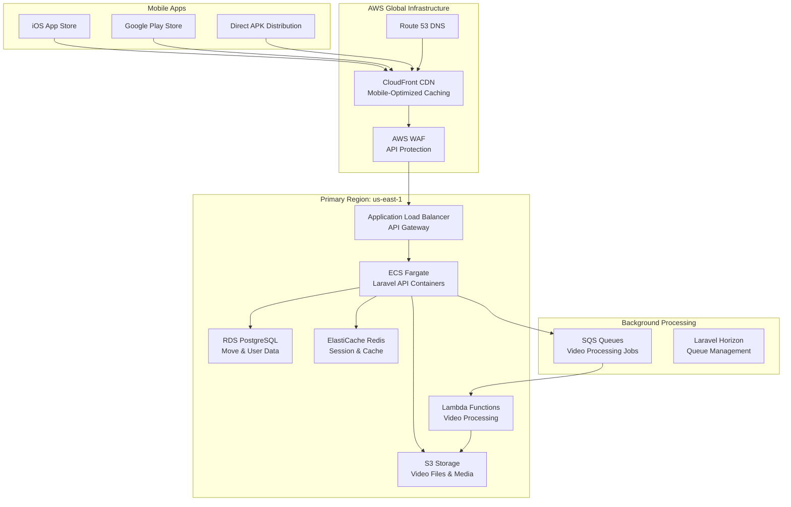

# Breiq - Breakdancing Platform Architecture

## 🎯 Executive Summary

Breiq is a mobile-first breakdancing move documentation platform built with **Flutter** (cross-platform mobile) and **Laravel** (API backend). The platform enables dancers to film, categorize, edit, and share breakdancing moves and routines with advanced video processing and social features.

## 📱 Platform Overview

### Core Purpose
- **Vision**: The ultimate digital companion for breakdancers to document, learn, and share moves
- **Target**: Global breakdancing community with focus on mobile-native experience
- **Performance**: Offline-capable mobile apps with cloud synchronization

### Key Features
- **Move Documentation**: Film and categorize moves by type (toprock, uprocking, power-trick, freeze, power-move, footwork, experimental, groove)
- **Advanced Video Editing**: In-app cropping, trimming, and FFmpeg-powered processing
- **Routine Builder**: Create choreographed sequences for battles and training
- **Social Community**: Share moves, routines, and discover new techniques
- **Offline Support**: Local storage with cloud sync for uninterrupted practice

---

## 📱 Frontend: Flutter Mobile Architecture

### 🏗️ Flutter Application Structure

```
breiq/ (Flutter App)
├── lib/
│   ├── core/                     # Core utilities and services
│   │   ├── constants/            # App constants and configurations
│   │   ├── services/             # Core services (API, storage, etc.)
│   │   ├── theme/                # App theming and styling
│   │   └── utils/                # Utility functions and helpers
│   ├── data/                     # Data layer (repositories, data sources)
│   │   ├── datasources/          # Remote and local data sources
│   │   ├── models/               # Data models and JSON serialization
│   │   └── repositories/         # Repository implementations
│   ├── domain/                   # Business logic layer
│   │   ├── entities/             # Domain entities (Video, Move, Routine)
│   │   ├── repositories/         # Repository interfaces
│   │   └── usecases/             # Business use cases
│   ├── presentation/             # UI layer
│   │   ├── pages/                # Screen widgets
│   │   ├── widgets/              # Reusable UI components
│   │   └── providers/            # Riverpod state management
│   └── plugins/                  # Native platform integrations
│       └── native_video_player/  # Custom video player plugin
```

### 📦 Key Flutter Dependencies

```yaml
# State Management & Architecture
flutter_riverpod: ^2.6.1         # State management
riverpod_annotation: ^2.5.0      # Code generation
go_router: ^14.3.0               # Navigation with deep linking

# Video & Camera Capabilities
camera: ^0.11.0+2                # Camera access for filming
video_player: ^2.9.1             # Video playback
video_thumbnail: ^0.5.3          # Video thumbnail generation
ffmpeg_kit_flutter: ^3.2.0       # Advanced video processing
video_editor: ^3.0.0             # In-app video editing
photo_manager: ^3.5.0            # Gallery access

# Authentication & API
dio: ^5.7.0                      # HTTP client for Laravel API
retrofit: ^4.4.1                 # Type-safe API client
google_sign_in: ^6.2.1           # Google OAuth integration

# Local Storage & Caching
hive_flutter: ^1.1.0             # Fast local database
sqflite: ^2.3.0                  # SQLite for complex queries
shared_preferences: ^2.3.2        # Simple key-value storage
cached_network_image: ^3.4.1     # Image caching

# Monitoring & Analytics
sentry_flutter: ^8.9.0           # Crash reporting and performance
firebase_core: ^3.6.0            # Firebase services
firebase_messaging: ^15.1.3      # Push notifications
```

### 🎯 Flutter Architecture Patterns

#### Clean Architecture Implementation
```dart
// Domain Entity
class Move {
  final String id;
  final String name;
  final MoveCategory category;
  final String videoPath;
  final Duration clipStart;
  final Duration clipEnd;
  final DateTime createdAt;
  
  const Move({
    required this.id,
    required this.name,
    required this.category,
    required this.videoPath,
    required this.clipStart,
    required this.clipEnd,
    required this.createdAt,
  });
}

// Repository Interface
abstract class MoveRepository {
  Future<List<Move>> getMovesByCategory(MoveCategory category);
  Future<Move> createMove(CreateMoveRequest request);
  Future<void> deleteMove(String moveId);
  Future<List<Move>> syncMovesWithServer();
}

// Use Case
class CreateMoveUseCase {
  final MoveRepository repository;
  final VideoProcessingService videoService;
  
  CreateMoveUseCase(this.repository, this.videoService);
  
  Future<Move> call(CreateMoveParams params) async {
    // Process video
    final processedVideo = await videoService.processVideo(
      params.videoFile,
      startTime: params.clipStart,
      endTime: params.clipEnd,
    );
    
    // Create move
    return repository.createMove(CreateMoveRequest(
      name: params.name,
      category: params.category,
      videoPath: processedVideo.path,
      clipStart: params.clipStart,
      clipEnd: params.clipEnd,
    ));
  }
}
```

#### Riverpod State Management
```dart
// Providers for dependency injection
@riverpod
MoveRepository moveRepository(MoveRepositoryRef ref) {
  return MoveRepositoryImpl(
    localDataSource: ref.watch(moveLocalDataSourceProvider),
    remoteDataSource: ref.watch(moveRemoteDataSourceProvider),
  );
}

@riverpod
class MoveListNotifier extends _$MoveListNotifier {
  @override
  Future<List<Move>> build(MoveCategory category) async {
    final repository = ref.watch(moveRepositoryProvider);
    return repository.getMovesByCategory(category);
  }
  
  Future<void> createMove(CreateMoveParams params) async {
    final useCase = ref.read(createMoveUseCaseProvider);
    final newMove = await useCase(params);
    
    // Update state
    state = AsyncValue.data([
      ...state.value ?? [],
      newMove,
    ]);
  }
}

// Widget consuming state
class MovesPage extends ConsumerWidget {
  @override
  Widget build(BuildContext context, WidgetRef ref) {
    final movesAsync = ref.watch(moveListNotifierProvider(MoveCategory.powerMove));
    
    return movesAsync.when(
      loading: () => const CircularProgressIndicator(),
      error: (error, stack) => Text('Error: $error'),
      data: (moves) => ListView.builder(
        itemCount: moves.length,
        itemBuilder: (context, index) => MoveCard(move: moves[index]),
      ),
    );
  }
}
```

---

## 🔧 Backend: Laravel API Architecture

### 🏗️ Laravel Application Structure

```
breiq-backend/ (Laravel API)
├── app/
│   ├── DTOs/                     # Data Transfer Objects
│   │   ├── Move/                 # Move-related DTOs
│   │   ├── Routine/              # Routine-related DTOs
│   │   └── User/                 # User-related DTOs
│   ├── Http/
│   │   ├── Controllers/          # API Controllers
│   │   ├── Middleware/           # Custom middleware
│   │   ├── Requests/             # Form request validation
│   │   └── Resources/            # API resource transformations
│   ├── Models/                   # Eloquent models
│   ├── Repositories/             # Repository pattern implementation
│   ├── Services/                 # Business logic services
│   └── Jobs/                     # Background job processing
├── database/
│   ├── migrations/               # Database schema migrations
│   ├── seeders/                  # Database seeders
│   └── factories/                # Model factories for testing
├── routes/
│   ├── api.php                   # API routes
│   └── web.php                   # Web routes (minimal)
└── config/                       # Configuration files
```

### 📦 Key Laravel Dependencies

```json
{
  "require": {
    "php": "^8.2",
    "laravel/framework": "^12.0",
    "laravel/sanctum": "^4.2",           // API authentication
    "laravel/socialite": "^5.23",        // Google OAuth
    "laravel/horizon": "^5.33",          // Queue management
    "laravel/octane": "^2.12",           // Performance enhancement
    "spatie/laravel-permission": "^6.21", // Role-based permissions
    "league/flysystem-aws-s3-v3": "^3.29", // S3 integration
    "intervention/image": "^3.11",        // Image processing
    "google/auth": "^1.28"                // Google services integration
  }
}
```

### 🎯 Laravel Architecture Patterns

#### Repository Pattern Implementation
```php
<?php

namespace App\Repositories\Move;

use App\Models\Move;
use App\DTOs\Move\CreateMoveDTO;
use App\DTOs\Move\UpdateMoveDTO;
use Illuminate\Database\Eloquent\Collection;

interface MoveRepositoryInterface
{
    public function findByCategory(string $category, ?int $userId = null): Collection;
    public function create(CreateMoveDTO $dto): Move;
    public function update(Move $move, UpdateMoveDTO $dto): Move;
    public function delete(Move $move): bool;
    public function findUserMoves(int $userId): Collection;
}

class MoveRepository implements MoveRepositoryInterface
{
    public function findByCategory(string $category, ?int $userId = null): Collection
    {
        $query = Move::where('category', $category)
            ->with(['user', 'media'])
            ->where('is_public', true);
            
        if ($userId) {
            $query->orWhere('user_id', $userId);
        }
        
        return $query->orderBy('created_at', 'desc')->get();
    }
    
    public function create(CreateMoveDTO $dto): Move
    {
        return Move::create([
            'user_id' => $dto->userId,
            'name' => $dto->name,
            'category' => $dto->category->value,
            'description' => $dto->description,
            'video_path' => $dto->videoPath,
            'thumbnail_path' => $dto->thumbnailPath,
            'clip_start_seconds' => $dto->clipStart,
            'clip_end_seconds' => $dto->clipEnd,
            'is_public' => $dto->isPublic,
            'metadata' => $dto->metadata,
        ]);
    }
    
    // ... other methods
}
```

#### Controller with Full Architecture
```php
<?php

namespace App\Http\Controllers\Api\V1;

use App\Http\Controllers\Controller;
use App\Http\Requests\Move\CreateMoveRequest;
use App\Http\Requests\Move\UpdateMoveRequest;
use App\Http\Resources\MoveResource;
use App\Services\MoveService;
use App\DTOs\Move\CreateMoveDTO;
use App\Repositories\Move\MoveRepositoryInterface;
use Illuminate\Http\JsonResponse;
use Illuminate\Http\Resources\Json\AnonymousResourceCollection;
use Illuminate\Support\Facades\Gate;

class MoveController extends Controller
{
    public function __construct(
        private readonly MoveService $moveService,
        private readonly MoveRepositoryInterface $moveRepository
    ) {}
    
    /**
     * Get moves by category.
     * 
     * @param string $category
     * @return AnonymousResourceCollection
     */
    public function index(string $category): AnonymousResourceCollection
    {
        Gate::authorize('viewAny', Move::class);
        
        $moves = $this->moveRepository->findByCategory(
            $category, 
            auth()->id()
        );
        
        return MoveResource::collection($moves);
    }
    
    /**
     * Create a new move.
     * 
     * @param CreateMoveRequest $request
     * @return JsonResponse
     */
    public function store(CreateMoveRequest $request): JsonResponse
    {
        Gate::authorize('create', Move::class);
        
        $dto = new CreateMoveDTO(
            userId: auth()->id(),
            name: $request->validated('name'),
            category: MoveCategory::from($request->validated('category')),
            description: $request->validated('description'),
            videoFile: $request->file('video'),
            clipStart: $request->validated('clip_start'),
            clipEnd: $request->validated('clip_end'),
            isPublic: $request->validated('is_public', true),
            metadata: $request->validated('metadata', [])
        );
        
        $move = $this->moveService->createMove($dto);
        
        return response()->json([
            'message' => 'Move created successfully',
            'data' => new MoveResource($move)
        ], 201);
    }
    
    // ... other methods
}
```

#### Custom Request Validation
```php
<?php

namespace App\Http\Requests\Move;

use Illuminate\Foundation\Http\FormRequest;
use App\Enums\MoveCategory;
use Illuminate\Validation\Rules\Enum;

class CreateMoveRequest extends FormRequest
{
    /**
     * Determine if the user is authorized to make this request.
     */
    public function authorize(): bool
    {
        return auth()->check();
    }

    /**
     * Get the validation rules that apply to the request.
     *
     * @return array<string, \Illuminate\Contracts\Validation\ValidationRule|array<mixed>|string>
     */
    public function rules(): array
    {
        return [
            'name' => ['required', 'string', 'max:255', 'min:3'],
            'category' => ['required', new Enum(MoveCategory::class)],
            'description' => ['nullable', 'string', 'max:1000'],
            'video' => [
                'required',
                'file',
                'mimes:mp4,mov,avi,wmv',
                'max:100000', // 100MB
                'dimensions:min_width=480,min_height=640'
            ],
            'clip_start' => ['required', 'integer', 'min:0'],
            'clip_end' => ['required', 'integer', 'gt:clip_start'],
            'is_public' => ['boolean'],
            'metadata' => ['array'],
            'metadata.filming_location' => ['string', 'max:255'],
            'metadata.difficulty_level' => ['integer', 'between:1,10'],
            'metadata.tags' => ['array'],
            'metadata.tags.*' => ['string', 'max:50']
        ];
    }

    /**
     * Get custom error messages.
     */
    public function messages(): array
    {
        return [
            'name.required' => 'Move name is required',
            'name.min' => 'Move name must be at least 3 characters',
            'category.required' => 'Move category must be selected',
            'video.required' => 'Video file is required',
            'video.max' => 'Video file size cannot exceed 100MB',
            'clip_end.gt' => 'End time must be after start time',
        ];
    }
}
```

---

## 🏗️ AWS Infrastructure Architecture

### Mobile-Optimized Infrastructure



### Infrastructure Components

#### 1. Mobile App Distribution
- **iOS**: App Store Connect with TestFlight for beta testing
- **Android**: Google Play Console with internal testing tracks
- **Direct Distribution**: APK distribution for Android users outside Play Store

#### 2. API Infrastructure
```yaml
# ECS Fargate Configuration for Laravel
Service: breiq-laravel-api
CPU: 1024 (1 vCPU)
Memory: 2048 MB (2 GB)
Desired Count: 3 (Auto-scaling 2-10)
Health Check: /api/health

# Application Load Balancer
Type: Application Load Balancer
Scheme: Internet-facing
Target Groups:
  - Laravel API (Port 80/443)
  - Health Check (/api/health)

# Auto Scaling Policy
Scale Out: CPU > 70% OR Memory > 80%
Scale In: CPU < 30% AND Memory < 50%
Cooldown: 300 seconds
```

#### 3. Database Strategy
```yaml
# PostgreSQL for Relational Data
Engine: PostgreSQL 15.4
Instance: db.r6g.large (Production) / db.t4g.medium (Staging)
Storage: 100GB GP3 SSD with auto-scaling
Backup: 30 days retention (Production) / 7 days (Staging)
Multi-AZ: Enabled (Production only)

# Tables:
# - users (auth, profiles, preferences)
# - moves (breakdancing moves, metadata)
# - routines (choreographed sequences)
# - move_routine (many-to-many pivot)
# - media (video files, thumbnails)
# - categories (move classifications)

# Redis for Caching & Sessions
Node Type: cache.r6g.medium
Nodes: 2 (with failover)
Engine: Redis 7.x
Use Cases:
  - API response caching
  - User session storage
  - Video processing job queues
  - Rate limiting counters
```

#### 4. Storage Architecture
```yaml
# S3 Bucket Strategy
Primary Bucket: breiq-videos-{environment}
Structure:
  /moves/{user_id}/{move_id}/
    - original.mp4 (original upload)
    - processed.mp4 (optimized for mobile)
    - thumbnail.jpg (auto-generated)
    - metadata.json (video information)
  /routines/{user_id}/{routine_id}/
    - preview.mp4 (routine preview)
    - full.mp4 (complete routine)
  /profiles/{user_id}/
    - avatar.jpg (profile pictures)

# Lifecycle Policies:
# - Original files: Glacier after 90 days
# - Processed files: Standard for 30 days, IA after
# - Thumbnails: Standard (frequently accessed)

# CORS Configuration for Mobile Apps
AllowedMethods: [GET, PUT, POST, DELETE]
AllowedOrigins: ['app://breiq', 'https://*.breiq.online']
AllowedHeaders: ['*']
ExposeHeaders: ['ETag', 'Content-Length']
```

#### 5. Video Processing Pipeline
```yaml
# Lambda Functions for Video Processing
Function: video-processor
Runtime: Python 3.11
Memory: 3008 MB (maximum)
Timeout: 15 minutes
Trigger: S3 upload events

Processing Steps:
1. Validate video format and duration
2. Generate thumbnail at 3-second mark
3. Optimize for mobile viewing (reduce bitrate)
4. Extract metadata (duration, resolution, fps)
5. Update database with processed file URLs
6. Send push notification to user

# SQS Queue Configuration
Queue: video-processing-queue
Visibility Timeout: 900 seconds (15 minutes)
Message Retention: 14 days
Dead Letter Queue: video-processing-dlq (after 3 failures)
```

---

## 🔐 Security Architecture

### Mobile App Security
```dart
// Flutter Security Implementation
class SecurityService {
  // Certificate pinning for API calls
  static Dio createSecureHttpClient() {
    final dio = Dio();
    
    dio.interceptors.add(
      CertificatePinningInterceptor(
        allowedSHAFingerprints: ['EXPECTED_SHA_FINGERPRINT'],
      ),
    );
    
    return dio;
  }
  
  // Secure storage for sensitive data
  static Future<void> storeSecureData(String key, String value) async {
    const storage = FlutterSecureStorage(
      aOptions: AndroidOptions(
        encryptedSharedPreferences: true,
      ),
      iOptions: IOSOptions(
        accessibility: IOSAccessibility.first_unlock_this_device,
      ),
    );
    
    await storage.write(key: key, value: value);
  }
  
  // Biometric authentication
  static Future<bool> authenticateWithBiometrics() async {
    final localAuth = LocalAuthentication();
    
    final isAvailable = await localAuth.canCheckBiometrics;
    if (!isAvailable) return false;
    
    return await localAuth.authenticate(
      localizedReason: 'Authenticate to access your moves',
      options: AuthenticationOptions(
        biometricOnly: true,
        stickyAuth: true,
      ),
    );
  }
}
```

### Laravel API Security
```php
<?php

namespace App\Http\Middleware;

use Closure;
use Illuminate\Http\Request;
use Illuminate\Support\Facades\RateLimiter;

class ApiRateLimitMiddleware
{
    public function handle(Request $request, Closure $next)
    {
        // Different rate limits for different endpoints
        $key = $this->resolveRequestSignature($request);
        
        $limits = [
            'video_upload' => 5,    // 5 uploads per hour
            'move_create' => 10,    // 10 moves per hour
            'api_general' => 1000,  // 1000 requests per hour
        ];
        
        $endpoint = $this->getEndpointType($request);
        $limit = $limits[$endpoint] ?? $limits['api_general'];
        
        if (RateLimiter::tooManyAttempts($key, $limit)) {
            return response()->json([
                'message' => 'Rate limit exceeded',
                'retry_after' => RateLimiter::availableIn($key),
            ], 429);
        }
        
        RateLimiter::hit($key, 3600); // 1 hour window
        
        return $next($request);
    }
    
    private function resolveRequestSignature(Request $request): string
    {
        $userId = $request->user()?->id ?? 'guest';
        $ip = $request->ip();
        $endpoint = $this->getEndpointType($request);
        
        return "rate_limit:{$endpoint}:{$userId}:{$ip}";
    }
    
    private function getEndpointType(Request $request): string
    {
        if ($request->is('api/*/moves/upload')) return 'video_upload';
        if ($request->is('api/*/moves') && $request->isMethod('POST')) return 'move_create';
        
        return 'api_general';
    }
}
```

---

## 📊 Performance Specifications

### Mobile App Performance Targets
```yaml
App Launch Time: < 2 seconds (cold start)
Video Load Time: < 1 second (cached), < 3 seconds (network)
Move Creation: < 5 seconds (local processing)
Cloud Sync: < 10 seconds (background)
Offline Capability: 100% core features available
Memory Usage: < 150MB average, < 300MB peak
Battery Impact: Minimal background processing
```

### Laravel API Performance Targets
```yaml
Response Times (95th percentile):
  - GET /api/v1/moves: < 200ms
  - POST /api/v1/moves: < 500ms (without video processing)
  - GET /api/v1/routines: < 150ms
  - POST /api/v1/auth/login: < 300ms

Throughput:
  - API requests/second: 1,000+
  - Concurrent users: 10,000+
  - Video uploads/hour: 500+

Database Performance:
  - Query response time: < 50ms average
  - Connection pool: 20 connections max
  - Cache hit ratio: > 85%
```

### Auto-Scaling Configuration
```yaml
# ECS Service Auto Scaling
Min Capacity: 2 tasks
Max Capacity: 20 tasks
Target CPU: 70%
Target Memory: 80%
Scale Out Cooldown: 300s
Scale In Cooldown: 600s

# Application Metrics
- API response time monitoring
- Database connection monitoring  
- Video processing queue length
- Mobile app crash reporting
- User engagement metrics
```

---

## 🚀 Deployment Strategy

### Mobile App Deployment
```yaml
# iOS Deployment Pipeline
1. Build iOS app with Flutter
2. Run automated tests (unit + integration)
3. Code signing with Apple certificates
4. Upload to App Store Connect
5. TestFlight beta testing
6. App Store review and release

# Android Deployment Pipeline
1. Build Android APK/AAB with Flutter
2. Run automated tests and static analysis
3. Sign with release keystore
4. Upload to Google Play Console
5. Internal testing track deployment
6. Staged rollout (5% → 25% → 50% → 100%)

# CI/CD Configuration (GitHub Actions)
trigger: [main, develop]
strategy:
  matrix:
    platform: [ios, android]
    
steps:
  - Flutter setup and dependencies
  - Code generation (build_runner)
  - Static analysis (flutter analyze)
  - Unit and widget tests
  - Integration tests on emulators
  - Build platform-specific apps
  - Deploy to respective app stores
```

### Laravel API Deployment
```yaml
# Container Deployment Strategy
Base Image: php:8.2-fpm-alpine
Multi-stage Build:
  1. Composer install (production optimized)
  2. PHP-FPM configuration
  3. Laravel optimization (config:cache, route:cache)
  4. Security hardening

# ECS Deployment Configuration
Deployment Type: Rolling update
Min Healthy Percent: 50%
Max Healthy Percent: 200%
Health Check Grace Period: 60 seconds
Stop Timeout: 30 seconds

# Zero-Downtime Deployment Steps
1. Build new Docker image
2. Push to ECR repository  
3. Update ECS task definition
4. Rolling deployment across AZs
5. Health checks validation
6. Automatic rollback on failure
```

---

## 📈 Monitoring & Analytics

### Application Monitoring
```yaml
# Mobile App Analytics (Firebase + Sentry)
Crash Reporting: Sentry Flutter SDK
Performance Monitoring: Firebase Performance
User Analytics: Firebase Analytics
Custom Events:
  - move_created
  - routine_completed  
  - video_shared
  - app_opened_offline

# API Monitoring (CloudWatch + Laravel Telescope)
Metrics:
  - API response times
  - Error rates by endpoint
  - Database query performance
  - Queue job processing times
  - Video processing success rates

Alerts:
  - API error rate > 5%
  - Average response time > 500ms
  - Database CPU > 80%
  - Queue backlog > 100 jobs
  - Storage usage > 80%
```

### Business Intelligence
```yaml
# Key Performance Indicators
User Engagement:
  - Daily Active Users (DAU)
  - Weekly Active Users (WAU)
  - Average session duration
  - Move creation frequency
  - Routine completion rate

Technical Metrics:
  - App store ratings and reviews
  - API uptime percentage
  - Video processing success rate
  - Average video upload time
  - Cross-platform usage distribution

Growth Metrics:
  - New user registrations
  - User retention (Day 1, 7, 30)
  - Feature adoption rates
  - Geographic user distribution
  - Move category popularity
```

---

## 💰 Cost Optimization

### AWS Infrastructure Costs (Monthly Estimates)
```yaml
# Production Environment
ECS Fargate: $200 (3 tasks × 1 vCPU × 2GB)
RDS PostgreSQL: $150 (db.r6g.large)
ElastiCache Redis: $80 (cache.r6g.medium × 2)
S3 Storage: $100 (5TB video storage + requests)
CloudFront: $50 (1TB data transfer)
Lambda: $30 (video processing)
Total: ~$610/month

# Cost Optimization Strategies
- S3 Intelligent Tiering for old videos
- Spot instances for development environments  
- Reserved instances for predictable workloads
- CloudFront edge caching to reduce origin requests
- Efficient video compression to reduce storage
```

### App Store Fees
```yaml
iOS App Store: 30% of in-app purchases (first year)
                15% (after year one per subscriber)
Google Play: 30% of in-app purchases (first $1M)
             15% (after $1M annual revenue)

# Monetization Strategy
Freemium Model:
  - Basic move documentation: Free
  - Advanced editing features: Premium
  - Routine sharing: Premium  
  - Cloud storage expansion: Premium
  - Priority video processing: Premium
```

---

## 🔮 Future Roadmap

### Phase 2 Features (6 months)
```yaml
Advanced Features:
  - AI-powered move recognition and categorization
  - Slow-motion analysis with frame-by-frame controls
  - Battle mode with judging system
  - Live streaming for virtual battles
  - Augmented Reality move visualization

Technical Improvements:
  - GraphQL API for improved mobile data fetching
  - WebRTC for real-time collaboration
  - Machine Learning for personalized recommendations
  - Advanced video compression with AV1 codec
```

### Phase 3 Expansion (12 months)
```yaml
Platform Growth:
  - Web application for instructors and judges
  - Smart TV app for studio displays
  - Wearable device integration (Apple Watch, Fitbit)
  - VR training modules for immersive learning

Global Expansion:
  - Multi-language support (Spanish, French, Korean, Japanese)
  - Regional breaking style categories
  - Local battle event integration
  - Currency support for international monetization
```

---

## 📝 Conclusion

The Breiq breakdancing platform represents a sophisticated mobile-first architecture built specifically for the global breaking community. By leveraging Flutter's cross-platform capabilities and Laravel's robust API framework, the platform delivers native mobile performance while maintaining scalable cloud infrastructure.

**Key Achievements:**
- ✅ Native mobile experience across iOS and Android
- ✅ Advanced video processing and editing capabilities
- ✅ Offline-first architecture with cloud synchronization
- ✅ Scalable Laravel API with clean architecture patterns
- ✅ AWS infrastructure optimized for mobile delivery
- ✅ Comprehensive monitoring and analytics
- ✅ Cost-effective deployment strategy

**Production-Ready Features:**
- Cross-platform mobile apps with app store distribution
- RESTful API with authentication and authorization
- Advanced video processing pipeline
- Real-time synchronization and offline support
- Comprehensive testing and quality assurance
- Performance monitoring and crash reporting

This architecture provides a solid foundation for scaling to serve the global breakdancing community while maintaining exceptional mobile performance and user experience.

---

*Documentation Version: 2.0.0 (Corrected Flutter + Laravel)*  
*Last Updated: $(date)*  
*Platform: Breiq Breakdancing Documentation Platform*