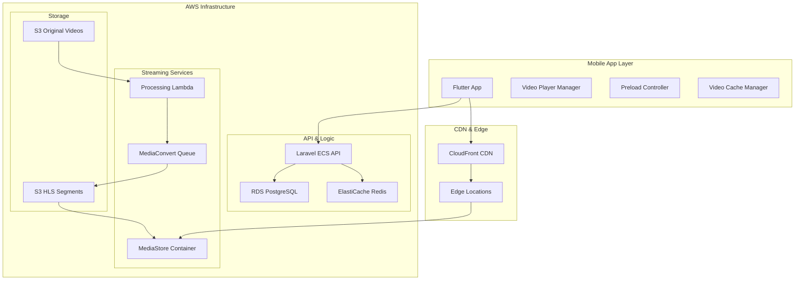

# 🎥 Instagram Reels Architecture for Breiq

*Implementation Plan for Video Streaming, Preloading & Caching*

---

## 📋 **Overview**

This document outlines the complete transformation of Breiq from a basic video upload platform to an Instagram Reels-like experience with advanced video streaming, preloading, and caching capabilities.

### **Current vs Target Architecture**

| Current ❌ | Target ✅ |
|------------|-----------|
| Single video files in S3 | Multi-bitrate adaptive streaming (HLS) |
| No preloading/caching | Aggressive preloading (next 3-5 videos) |
| Basic video player | CloudFront CDN edge caching |
| Linear video loading | Infinite scroll with smooth transitions |
| No optimization | Background prefetching based on user behavior |

---

## 🏗️ **Technical Architecture**

### **High-Level System Design**



### **Video Processing Pipeline**

```yaml
Pipeline_Flow:
  1. User_Upload: 
     - Original video → S3 bucket
     - Metadata → PostgreSQL
     - Status: "processing"
  
  2. Lambda_Trigger:
     - S3 event → Lambda function
     - Create MediaConvert job
     - Update status: "transcoding"
  
  3. MediaConvert_Processing:
     - Generate multiple bitrates (240p, 480p, 720p, 1080p)
     - Create HLS playlist (.m3u8) + segments (.ts)
     - Output to S3 HLS bucket
  
  4. MediaStore_Distribution:
     - Copy HLS files to MediaStore
     - Generate CDN URLs
     - Update status: "ready"
  
  5. CDN_Caching:
     - CloudFront edge caching
     - Global distribution
     - Intelligent preloading
```

---

## 💻 **Flutter Implementation**

### **New Video Architecture**

```dart
// Core Video Management System
class ReelsVideoManager {
  final VideoController controller;
  final PreloadManager preloader;
  final CacheManager cache;
  final NetworkMonitor network;
  
  // Initialize with intelligent caching
  ReelsVideoManager() {
    cache = VideoCacheManager(
      maxCacheSize: 500, // MB
      maxCacheFiles: 50,
      stalePeriod: Duration(days: 7),
    );
  }
  
  // Preload upcoming videos based on user behavior
  Future<void> preloadNextVideos(List<Video> upcoming) async {
    final quality = _determineOptimalQuality();
    
    for (int i = 0; i < upcoming.length && i < 5; i++) {
      final priority = i == 0 ? PreloadPriority.high : PreloadPriority.medium;
      
      await preloader.preloadVideo(
        video: upcoming[i],
        quality: quality,
        priority: priority,
      );
    }
  }
  
  // Smart quality selection based on network conditions
  VideoQuality _determineOptimalQuality() {
    final bandwidth = network.estimatedBandwidth;
    final isWifi = network.connectionType == NetworkType.wifi;
    
    if (isWifi && bandwidth > 5000) return VideoQuality.hd1080;
    if (bandwidth > 2500) return VideoQuality.hd720;
    if (bandwidth > 1000) return VideoQuality.sd480;
    return VideoQuality.sd240;
  }
  
  // Cleanup old cache to manage memory
  void cleanupCache(int currentIndex) {
    // Remove videos that are more than 10 positions behind
    cache.removeRange(
      start: math.max(0, currentIndex - 10),
      end: currentIndex - 5,
    );
  }
}

// Infinite Scroll Feed Controller
class ReelsFeedController extends ChangeNotifier {
  final PageController pageController;
  final ReelsVideoManager videoManager;
  final List<Video> videos = [];
  final Set<int> preloadedIndices = {};
  
  int currentIndex = 0;
  bool isLoading = false;
  
  @override
  void onPageChanged(int index) {
    currentIndex = index;
    notifyListeners();
    
    _handleVideoChange(index);
    _checkNeedMoreVideos(index);
    _preloadUpcomingVideos(index);
    _cleanupOldVideos(index);
  }
  
  void _handleVideoChange(int index) {
    // Pause previous video
    if (index > 0) {
      videoManager.pauseVideo(videos[index - 1]);
    }
    
    // Play current video
    videoManager.playVideo(videos[index]);
  }
  
  void _checkNeedMoreVideos(int index) {
    // Load more when reaching the last 3 videos
    if (index >= videos.length - 3 && !isLoading) {
      loadMoreVideos();
    }
  }
  
  void _preloadUpcomingVideos(int index) {
    final upcomingVideos = videos
        .skip(index + 1)
        .take(5)
        .where((v) => !preloadedIndices.contains(v.id))
        .toList();
    
    if (upcomingVideos.isNotEmpty) {
      videoManager.preloadNextVideos(upcomingVideos);
      preloadedIndices.addAll(upcomingVideos.map((v) => v.id));
    }
  }
  
  void _cleanupOldVideos(int index) {
    videoManager.cleanupCache(index);
    
    // Remove from preloaded set
    if (index > 10) {
      final oldIndices = videos
          .take(index - 10)
          .map((v) => v.id)
          .toSet();
      preloadedIndices.removeAll(oldIndices);
    }
  }
  
  Future<void> loadMoreVideos() async {
    if (isLoading) return;
    
    isLoading = true;
    notifyListeners();
    
    try {
      final response = await ApiService.getReelsFeed(
        page: (videos.length / 10).ceil() + 1,
      );
      
      videos.addAll(response.videos);
      notifyListeners();
    } catch (e) {
      print('Error loading more videos: $e');
    } finally {
      isLoading = false;
      notifyListeners();
    }
  }
}

// Video Player Widget with HLS Support
class ReelsVideoPlayer extends StatefulWidget {
  final Video video;
  final bool isActive;
  
  const ReelsVideoPlayer({
    Key? key,
    required this.video,
    required this.isActive,
  }) : super(key: key);
  
  @override
  _ReelsVideoPlayerState createState() => _ReelsVideoPlayerState();
}

class _ReelsVideoPlayerState extends State<ReelsVideoPlayer> {
  late VideoPlayerController _controller;
  bool _isInitialized = false;
  
  @override
  void initState() {
    super.initState();
    _initializePlayer();
  }
  
  void _initializePlayer() async {
    // Use HLS URL for streaming
    _controller = VideoPlayerController.network(
      widget.video.hlsUrl,
      httpHeaders: {
        'User-Agent': 'Breiq/1.0',
        'Referer': 'https://breiq.online',
      },
    );
    
    await _controller.initialize();
    
    if (mounted) {
      setState(() {
        _isInitialized = true;
      });
      
      // Auto-play if this is the active video
      if (widget.isActive) {
        _controller.play();
      }
    }
  }
  
  @override
  void didUpdateWidget(ReelsVideoPlayer oldWidget) {
    super.didUpdateWidget(oldWidget);
    
    // Handle play/pause based on active state
    if (widget.isActive && !oldWidget.isActive) {
      _controller.play();
    } else if (!widget.isActive && oldWidget.isActive) {
      _controller.pause();
    }
  }
  
  @override
  Widget build(BuildContext context) {
    if (!_isInitialized) {
      return Container(
        color: Colors.black,
        child: Center(
          child: CircularProgressIndicator(),
        ),
      );
    }
    
    return AspectRatio(
      aspectRatio: _controller.value.aspectRatio,
      child: VideoPlayer(_controller),
    );
  }
  
  @override
  void dispose() {
    _controller.dispose();
    super.dispose();
  }
}

// Main Reels Feed Screen
class ReelsFeedScreen extends StatefulWidget {
  @override
  _ReelsFeedScreenState createState() => _ReelsFeedScreenState();
}

class _ReelsFeedScreenState extends State<ReelsFeedScreen> {
  late ReelsFeedController _feedController;
  late PageController _pageController;
  
  @override
  void initState() {
    super.initState();
    _pageController = PageController();
    _feedController = ReelsFeedController()
      ..pageController = _pageController;
    
    // Load initial videos
    _feedController.loadMoreVideos();
  }
  
  @override
  Widget build(BuildContext context) {
    return Scaffold(
      body: Consumer<ReelsFeedController>(
        builder: (context, controller, child) {
          if (controller.videos.isEmpty && controller.isLoading) {
            return Center(child: CircularProgressIndicator());
          }
          
          return PageView.builder(
            controller: _pageController,
            scrollDirection: Axis.vertical,
            onPageChanged: controller.onPageChanged,
            itemCount: controller.videos.length,
            itemBuilder: (context, index) {
              final video = controller.videos[index];
              final isActive = index == controller.currentIndex;
              
              return Stack(
                children: [
                  // Video Player
                  ReelsVideoPlayer(
                    video: video,
                    isActive: isActive,
                  ),
                  
                  // UI Overlay
                  ReelsUIOverlay(
                    video: video,
                    onLike: () => _handleLike(video),
                    onShare: () => _handleShare(video),
                    onComment: () => _handleComment(video),
                  ),
                ],
              );
            },
          );
        },
      ),
    );
  }
  
  void _handleLike(Video video) {
    // Implement like functionality
  }
  
  void _handleShare(Video video) {
    // Implement share functionality
  }
  
  void _handleComment(Video video) {
    // Implement comment functionality
  }
  
  @override
  void dispose() {
    _pageController.dispose();
    super.dispose();
  }
}
```

---

## 🛠️ **Laravel Backend Implementation**

### **New API Endpoints**

```php
<?php

namespace App\Http\Controllers\Api;

use App\Http\Controllers\Controller;
use App\Models\Video;
use App\Jobs\ProcessVideoForStreaming;
use Illuminate\Http\Request;
use Illuminate\Http\JsonResponse;

class ReelsController extends Controller
{
    /**
     * Get paginated feed for reels experience
     */
    public function getFeed(Request $request): JsonResponse
    {
        $request->validate([
            'page' => 'integer|min:1',
            'limit' => 'integer|min:1|max:20',
            'category' => 'string|nullable',
        ]);
        
        $page = $request->get('page', 1);
        $limit = $request->get('limit', 10);
        $category = $request->get('category');
        
        $query = Video::with(['user:id,username,avatar_url', 'move_category:id,name'])
            ->where('is_public', true)
            ->where('processing_status', 'ready')
            ->where('hls_ready', true);
        
        if ($category) {
            $query->whereHas('move_category', function ($q) use ($category) {
                $q->where('slug', $category);
            });
        }
        
        $videos = $query
            ->orderBy('created_at', 'desc')
            ->offset(($page - 1) * $limit)
            ->limit($limit)
            ->get()
            ->map(function ($video, $index) use ($page) {
                return [
                    'id' => $video->id,
                    'hls_url' => $this->getHLSUrl($video),
                    'thumbnail_url' => $this->getThumbnailUrl($video),
                    'poster_url' => $this->getPosterUrl($video),
                    'user' => [
                        'id' => $video->user->id,
                        'username' => $video->user->username,
                        'avatar_url' => $video->user->avatar_url,
                    ],
                    'metadata' => [
                        'duration' => $video->duration,
                        'category' => $video->move_category->name,
                        'likes_count' => $video->likes_count,
                        'views_count' => $video->views_count,
                        'comments_count' => $video->comments_count,
                        'created_at' => $video->created_at->toISOString(),
                    ],
                    'preload_priority' => $this->calculatePreloadPriority($index, $page),
                ];
            });

        return response()->json([
            'success' => true,
            'data' => [
                'videos' => $videos,
                'pagination' => [
                    'current_page' => $page,
                    'has_more' => $videos->count() === $limit,
                    'next_page' => $page + 1,
                    'total_loaded' => ($page - 1) * $limit + $videos->count(),
                ],
                'cache_hints' => [
                    'preload_next' => min(5, $videos->count()),
                    'cache_duration' => 300, // 5 minutes
                ],
            ],
        ]);
    }
    
    /**
     * Get video streaming analytics
     */
    public function getStreamingInfo(Request $request, string $videoId): JsonResponse
    {
        $video = Video::findOrFail($videoId);
        
        return response()->json([
            'video_id' => $video->id,
            'streaming_urls' => [
                'hls' => $this->getHLSUrl($video),
                'dash' => $this->getDASHUrl($video), // Future implementation
            ],
            'available_qualities' => $this->getAvailableQualities($video),
            'cdn_endpoints' => $this->getCDNEndpoints($video),
            'preload_segments' => $this->getPreloadSegments($video),
        ]);
    }
    
    /**
     * Track video analytics (views, watch time, etc.)
     */
    public function trackAnalytics(Request $request): JsonResponse
    {
        $request->validate([
            'video_id' => 'required|uuid|exists:videos,id',
            'event_type' => 'required|in:view,play,pause,seek,complete',
            'timestamp' => 'required|integer',
            'watch_time' => 'integer|nullable',
            'quality' => 'string|nullable',
            'buffer_events' => 'integer|nullable',
        ]);
        
        // Store analytics in Redis for real-time processing
        $analytics = [
            'video_id' => $request->video_id,
            'user_id' => auth()->id(),
            'event_type' => $request->event_type,
            'timestamp' => $request->timestamp,
            'watch_time' => $request->watch_time,
            'quality' => $request->quality,
            'buffer_events' => $request->buffer_events,
            'user_agent' => $request->userAgent(),
            'ip_address' => $request->ip(),
        ];
        
        // Store in Redis for real-time analytics
        Redis::lpush('video_analytics', json_encode($analytics));
        
        // Update video stats if it's a view event
        if ($request->event_type === 'view') {
            Video::where('id', $request->video_id)->increment('views_count');
        }
        
        return response()->json(['success' => true]);
    }
    
    /**
     * Get HLS streaming URL
     */
    private function getHLSUrl(Video $video): string
    {
        $baseUrl = config('services.cloudfront.video_domain');
        return "{$baseUrl}/hls/{$video->id}/playlist.m3u8";
    }
    
    /**
     * Get optimized thumbnail URL
     */
    private function getThumbnailUrl(Video $video): string
    {
        $baseUrl = config('services.cloudfront.image_domain');
        return "{$baseUrl}/thumbnails/{$video->id}/thumb_720.jpg";
    }
    
    /**
     * Get poster image URL
     */
    private function getPosterUrl(Video $video): string
    {
        $baseUrl = config('services.cloudfront.image_domain');
        return "{$baseUrl}/posters/{$video->id}/poster_1080.jpg";
    }
    
    /**
     * Calculate preload priority based on position
     */
    private function calculatePreloadPriority(int $index, int $page): string
    {
        if ($page === 1 && $index < 3) return 'high';
        if ($index < 5) return 'medium';
        return 'low';
    }
    
    /**
     * Get available video qualities
     */
    private function getAvailableQualities(Video $video): array
    {
        return [
            '240p' => ['bitrate' => 400000, 'resolution' => '426x240'],
            '480p' => ['bitrate' => 1000000, 'resolution' => '854x480'],
            '720p' => ['bitrate' => 2500000, 'resolution' => '1280x720'],
            '1080p' => ['bitrate' => 5000000, 'resolution' => '1920x1080'],
        ];
    }
    
    /**
     * Get CDN endpoints for different regions
     */
    private function getCDNEndpoints(Video $video): array
    {
        return [
            'global' => config('services.cloudfront.video_domain'),
            'regions' => [
                'us' => config('services.cloudfront.us_domain'),
                'eu' => config('services.cloudfront.eu_domain'),
                'asia' => config('services.cloudfront.asia_domain'),
            ],
        ];
    }
    
    /**
     * Get preload segments for faster startup
     */
    private function getPreloadSegments(Video $video): array
    {
        return [
            'init_segment' => $this->getHLSUrl($video) . '/init.mp4',
            'first_segments' => [
                $this->getHLSUrl($video) . '/segment_000.ts',
                $this->getHLSUrl($video) . '/segment_001.ts',
                $this->getHLSUrl($video) . '/segment_002.ts',
            ],
        ];
    }
}

/**
 * Video processing job for MediaConvert transcoding
 */
namespace App\Jobs;

use App\Models\Video;
use Aws\MediaConvert\MediaConvertClient;
use Illuminate\Bus\Queueable;
use Illuminate\Contracts\Queue\ShouldQueue;
use Illuminate\Queue\InteractsWithQueue;
use Illuminate\Queue\SerializesModels;
use Illuminate\Support\Facades\Log;

class ProcessVideoForStreaming implements ShouldQueue
{
    use InteractsWithQueue, Queueable, SerializesModels;
    
    protected Video $video;
    
    public function __construct(Video $video)
    {
        $this->video = $video;
    }
    
    public function handle(): void
    {
        try {
            $this->video->update(['processing_status' => 'transcoding']);
            
            $mediaConvert = new MediaConvertClient([
                'region' => config('services.aws.region'),
                'version' => '2017-08-29',
                'credentials' => [
                    'key' => config('services.aws.key'),
                    'secret' => config('services.aws.secret'),
                ],
                'endpoint' => config('services.aws.mediaconvert.endpoint'),
            ]);
            
            $job = $mediaConvert->createJob([
                'Role' => config('services.aws.mediaconvert.role_arn'),
                'Settings' => [
                    'Inputs' => [
                        [
                            'FileInput' => "s3://" . config('services.aws.bucket') . "/" . $this->video->file_path,
                            'AudioSelectors' => [
                                'Audio Selector 1' => [
                                    'DefaultSelection' => 'DEFAULT',
                                ],
                            ],
                            'VideoSelector' => [
                                'ColorSpace' => 'FOLLOW',
                            ],
                        ],
                    ],
                    'OutputGroups' => [
                        $this->createHLSOutputGroup(),
                        $this->createThumbnailOutputGroup(),
                    ],
                ],
                'Queue' => config('services.aws.mediaconvert.queue'),
                'UserMetadata' => [
                    'video_id' => $this->video->id,
                    'original_filename' => $this->video->original_filename,
                ],
                'Tags' => [
                    'project' => 'breiq',
                    'environment' => config('app.env'),
                    'video_id' => $this->video->id,
                ],
            ]);
            
            $this->video->update([
                'mediaconvert_job_id' => $job['Job']['Id'],
                'processing_status' => 'transcoding',
            ]);
            
            Log::info("MediaConvert job created for video {$this->video->id}", [
                'job_id' => $job['Job']['Id'],
                'video_id' => $this->video->id,
            ]);
            
        } catch (\Exception $e) {
            $this->video->update(['processing_status' => 'failed']);
            
            Log::error("MediaConvert job failed for video {$this->video->id}", [
                'error' => $e->getMessage(),
                'video_id' => $this->video->id,
            ]);
            
            throw $e;
        }
    }
    
    private function createHLSOutputGroup(): array
    {
        return [
            'Name' => 'HLS Adaptive Bitrate',
            'Outputs' => [
                $this->createHLSOutput('240p', 400000, '426x240'),
                $this->createHLSOutput('480p', 1000000, '854x480'),
                $this->createHLSOutput('720p', 2500000, '1280x720'),
                $this->createHLSOutput('1080p', 5000000, '1920x1080'),
            ],
            'OutputGroupSettings' => [
                'Type' => 'HLS_GROUP_SETTINGS',
                'HlsGroupSettings' => [
                    'Destination' => "s3://" . config('services.aws.hls_bucket') . "/hls/{$this->video->id}/",
                    'SegmentLength' => 6, // 6-second segments
                    'MinSegmentLength' => 0,
                    'DirectoryStructure' => 'SINGLE_DIRECTORY',
                    'ManifestDurationFormat' => 'INTEGER',
                    'StreamInfResolution' => 'INCLUDE',
                    'ClientCache' => 'ENABLED',
                    'ProgramDateTimePeriod' => 600,
                ],
            ],
        ];
    }
    
    private function createHLSOutput(string $name, int $bitrate, string $resolution): array
    {
        [$width, $height] = explode('x', $resolution);
        
        return [
            'NameModifier' => "_{$name}",
            'VideoDescription' => [
                'Width' => (int) $width,
                'Height' => (int) $height,
                'ScalingBehavior' => 'DEFAULT',
                'VideoPreprocessors' => [
                    'Deinterlacer' => [
                        'Algorithm' => 'INTERPOLATE',
                        'Mode' => 'DEINTERLACE',
                    ],
                ],
                'CodecSettings' => [
                    'Codec' => 'H_264',
                    'H264Settings' => [
                        'RateControlMode' => 'CBR',
                        'Bitrate' => $bitrate,
                        'CodecProfile' => 'HIGH',
                        'CodecLevel' => 'AUTO',
                        'MaxBitrate' => $bitrate,
                        'GopSize' => 60, // 2-second GOP at 30fps
                        'GopSizeUnits' => 'FRAMES',
                        'FramerateControl' => 'SPECIFIED',
                        'FramerateNumerator' => 30,
                        'FramerateDenominator' => 1,
                    ],
                ],
            ],
            'AudioDescriptions' => [
                [
                    'AudioSourceName' => 'Audio Selector 1',
                    'CodecSettings' => [
                        'Codec' => 'AAC',
                        'AacSettings' => [
                            'Bitrate' => 128000,
                            'SampleRate' => 48000,
                            'Specification' => 'MPEG4',
                            'CodingMode' => 'CODING_MODE_2_0',
                        ],
                    ],
                ],
            ],
            'ContainerSettings' => [
                'Container' => 'M3U8',
            ],
        ];
    }
    
    private function createThumbnailOutputGroup(): array
    {
        return [
            'Name' => 'Thumbnails',
            'Outputs' => [
                [
                    'NameModifier' => '_thumb_720',
                    'VideoDescription' => [
                        'Width' => 1280,
                        'Height' => 720,
                        'ScalingBehavior' => 'DEFAULT',
                        'CodecSettings' => [
                            'Codec' => 'FRAME_CAPTURE',
                            'FrameCaptureSettings' => [
                                'FramerateNumerator' => 1,
                                'FramerateDenominator' => 1,
                                'MaxCaptures' => 1,
                                'Quality' => 80,
                            ],
                        ],
                    ],
                    'ContainerSettings' => [
                        'Container' => 'RAW',
                    ],
                ],
            ],
            'OutputGroupSettings' => [
                'Type' => 'FILE_GROUP_SETTINGS',
                'FileGroupSettings' => [
                    'Destination' => "s3://" . config('services.aws.thumbnails_bucket') . "/thumbnails/{$this->video->id}/",
                ],
            ],
        ];
    }
}

/**
 * Event listener for MediaConvert job completion
 */
namespace App\Listeners;

use App\Models\Video;
use Illuminate\Support\Facades\Log;

class HandleMediaConvertJobComplete
{
    public function handle($event): void
    {
        $jobId = $event->jobId;
        $status = $event->status;
        
        $video = Video::where('mediaconvert_job_id', $jobId)->first();
        
        if (!$video) {
            Log::warning("Video not found for MediaConvert job: {$jobId}");
            return;
        }
        
        if ($status === 'COMPLETE') {
            $video->update([
                'processing_status' => 'ready',
                'hls_ready' => true,
                'processed_at' => now(),
            ]);
            
            // Copy HLS files to MediaStore for distribution
            dispatch(new CopyHLSToMediaStore($video));
            
            Log::info("Video processing completed: {$video->id}");
        } else {
            $video->update(['processing_status' => 'failed']);
            Log::error("Video processing failed: {$video->id}, Status: {$status}");
        }
    }
}
```

### **Database Schema Updates**

```php
<?php

// Migration: Add streaming fields to videos table
use Illuminate\Database\Migrations\Migration;
use Illuminate\Database\Schema\Blueprint;
use Illuminate\Support\Facades\Schema;

class AddStreamingFieldsToVideosTable extends Migration
{
    public function up(): void
    {
        Schema::table('videos', function (Blueprint $table) {
            // MediaConvert processing
            $table->string('mediaconvert_job_id')->nullable()->index();
            $table->boolean('hls_ready')->default(false)->index();
            $table->timestamp('processed_at')->nullable();
            
            // Video quality metrics
            $table->json('available_qualities')->nullable();
            $table->string('dominant_color')->nullable(); // For smooth UI transitions
            $table->float('aspect_ratio')->nullable();
            
            // Performance metrics
            $table->integer('preload_priority')->default(5);
            $table->json('streaming_analytics')->nullable();
            
            // CDN and caching
            $table->string('hls_manifest_url')->nullable();
            $table->string('thumbnail_720_url')->nullable();
            $table->string('poster_1080_url')->nullable();
            
            // Add indexes for performance
            $table->index(['is_public', 'hls_ready', 'created_at']);
            $table->index(['processing_status', 'hls_ready']);
        });
    }
    
    public function down(): void
    {
        Schema::table('videos', function (Blueprint $table) {
            $table->dropColumn([
                'mediaconvert_job_id',
                'hls_ready',
                'processed_at',
                'available_qualities',
                'dominant_color',
                'aspect_ratio',
                'preload_priority',
                'streaming_analytics',
                'hls_manifest_url',
                'thumbnail_720_url',
                'poster_1080_url',
            ]);
        });
    }
}

// Migration: Create video analytics table
class CreateVideoAnalyticsTable extends Migration
{
    public function up(): void
    {
        Schema::create('video_analytics', function (Blueprint $table) {
            $table->uuid('id')->primary();
            $table->uuid('video_id');
            $table->uuid('user_id')->nullable();
            $table->string('event_type'); // view, play, pause, seek, complete
            $table->integer('timestamp');
            $table->integer('watch_time')->nullable();
            $table->string('quality')->nullable();
            $table->integer('buffer_events')->default(0);
            $table->string('user_agent')->nullable();
            $table->ipAddress('ip_address')->nullable();
            $table->json('metadata')->nullable();
            $table->timestamps();
            
            // Indexes for analytics queries
            $table->index(['video_id', 'event_type', 'created_at']);
            $table->index(['user_id', 'created_at']);
            $table->index(['created_at']); // For time-based analytics
            
            $table->foreign('video_id')->references('id')->on('videos')->onDelete('cascade');
            $table->foreign('user_id')->references('id')->on('users')->onDelete('set null');
        });
    }
    
    public function down(): void
    {
        Schema::dropIfExists('video_analytics');
    }
}
```

---

## ☁️ **AWS Infrastructure Updates**

### **Media Services Terraform Configuration**

```hcl
# terraform/media_services.tf

# MediaConvert Queue for video processing
resource "aws_media_convert_queue" "main" {
  name        = "${var.project_name}-${var.environment}-queue"
  description = "Video processing queue for Breiq streaming"
  
  pricing_plan = "ON_DEMAND"
  status      = "ACTIVE"
  
  tags = {
    Name        = "${var.project_name}-${var.environment}-mediaconvert-queue"
    Environment = var.environment
    Purpose     = "video-transcoding"
  }
}

# S3 bucket for HLS streaming files
resource "aws_s3_bucket" "hls_streaming" {
  bucket = "${var.project_name}-${var.environment}-hls-streaming-${random_string.bucket_suffix.result}"
  
  tags = {
    Name        = "${var.project_name}-${var.environment}-hls-streaming"
    Environment = var.environment
    Purpose     = "hls-video-streaming"
  }
}

resource "aws_s3_bucket_public_access_block" "hls_streaming" {
  bucket = aws_s3_bucket.hls_streaming.id
  
  block_public_acls       = false
  block_public_policy     = false
  ignore_public_acls      = false
  restrict_public_buckets = false
}

resource "aws_s3_bucket_cors_configuration" "hls_streaming" {
  bucket = aws_s3_bucket.hls_streaming.id
  
  cors_rule {
    allowed_headers = ["*"]
    allowed_methods = ["GET", "HEAD"]
    allowed_origins = [
      "https://${var.domain_name}",
      "https://api.${var.domain_name}",
      "app://breiq"
    ]
    expose_headers  = ["ETag"]
    max_age_seconds = 3000
  }
}

# S3 bucket for thumbnails and posters
resource "aws_s3_bucket" "thumbnails" {
  bucket = "${var.project_name}-${var.environment}-thumbnails-${random_string.bucket_suffix.result}"
  
  tags = {
    Name        = "${var.project_name}-${var.environment}-thumbnails"
    Environment = var.environment
    Purpose     = "video-thumbnails"
  }
}

# MediaStore container for HLS origin
resource "aws_media_store_container" "streaming" {
  name = "${var.project_name}-${var.environment}-streaming"
  
  cors_policy = jsonencode([
    {
      allowed_headers = ["*"]
      allowed_methods = ["GET", "HEAD"]
      allowed_origins = [
        "https://${var.domain_name}",
        "app://breiq"
      ]
      max_age_seconds = 3000
    }
  ])
  
  container_policy = jsonencode({
    Version = "2012-10-17"
    Statement = [
      {
        Effect = "Allow"
        Principal = "*"
        Action = [
          "mediastore:GetObject",
          "mediastore:DescribeObject"
        ]
        Resource = "arn:aws:mediastore:${var.aws_region}:${data.aws_caller_identity.current.account_id}:container/${var.project_name}-${var.environment}-streaming/*"
      }
    ]
  })
  
  tags = {
    Name        = "${var.project_name}-${var.environment}-mediastore"
    Environment = var.environment
    Purpose     = "hls-streaming-origin"
  }
}

# CloudFront distribution for video streaming
resource "aws_cloudfront_distribution" "video_streaming" {
  enabled = true
  comment = "Breiq video streaming CDN"
  
  # MediaStore origin for HLS streaming
  origin {
    domain_name = replace(aws_media_store_container.streaming.endpoint, "https://", "")
    origin_id   = "MediaStoreOrigin"
    
    custom_origin_config {
      http_port              = 80
      https_port             = 443
      origin_protocol_policy = "https-only"
      origin_ssl_protocols   = ["TLSv1.2"]
    }
  }
  
  # S3 origin for thumbnails
  origin {
    domain_name = aws_s3_bucket.thumbnails.bucket_regional_domain_name
    origin_id   = "ThumbnailOrigin"
    
    s3_origin_config {
      origin_access_identity = aws_cloudfront_origin_access_identity.thumbnails.cloudfront_access_identity_path
    }
  }
  
  # Default cache behavior for HLS streaming
  default_cache_behavior {
    target_origin_id       = "MediaStoreOrigin"
    viewer_protocol_policy = "redirect-to-https"
    allowed_methods        = ["GET", "HEAD", "OPTIONS"]
    cached_methods         = ["GET", "HEAD"]
    compress              = true
    
    # Optimized for video streaming
    cache_policy_id = "4135ea2d-6df8-44a3-9df3-4b5a84be39ad" # AWS Managed-CachingOptimized
    
    # Custom headers for mobile apps
    response_headers_policy_id = aws_cloudfront_response_headers_policy.video_streaming.id
  }
  
  # Cache behavior for thumbnails
  ordered_cache_behavior {
    path_pattern     = "/thumbnails/*"
    target_origin_id = "ThumbnailOrigin"
    
    viewer_protocol_policy = "redirect-to-https"
    allowed_methods        = ["GET", "HEAD"]
    cached_methods         = ["GET", "HEAD"]
    compress              = true
    
    # Longer cache for thumbnails
    cache_policy_id = "658327ea-f89d-4fab-a63d-7e88639e58f6" # AWS Managed-CachingOptimizedForUncompressedObjects
  }
  
  # Geo restrictions (optional)
  restrictions {
    geo_restriction {
      restriction_type = "none"
    }
  }
  
  # SSL certificate
  viewer_certificate {
    acm_certificate_arn      = aws_acm_certificate_validation.main.certificate_arn
    ssl_support_method       = "sni-only"
    minimum_protocol_version = "TLSv1.2_2021"
  }
  
  # Custom domain
  aliases = ["cdn.${var.domain_name}"]
  
  tags = {
    Name        = "${var.project_name}-${var.environment}-video-cdn"
    Environment = var.environment
    Purpose     = "video-streaming"
  }
}

# Response headers policy for video streaming
resource "aws_cloudfront_response_headers_policy" "video_streaming" {
  name    = "${var.project_name}-${var.environment}-video-headers"
  comment = "Headers for video streaming optimization"
  
  cors_config {
    access_control_allow_credentials = false
    access_control_allow_origins {
      items = [
        "https://${var.domain_name}",
        "app://breiq"
      ]
    }
    access_control_allow_headers {
      items = ["*"]
    }
    access_control_allow_methods {
      items = ["GET", "HEAD", "OPTIONS"]
    }
    access_control_max_age_sec = 3600
    origin_override = false
  }
  
  custom_headers_config {
    items {
      header   = "X-Frame-Options"
      value    = "DENY"
      override = false
    }
    items {
      header   = "X-Content-Type-Options"
      value    = "nosniff"
      override = false
    }
    items {
      header   = "Cache-Control"
      value    = "public, max-age=31536000"
      override = false
    }
  }
}

# Origin Access Identity for S3 thumbnails
resource "aws_cloudfront_origin_access_identity" "thumbnails" {
  comment = "OAI for thumbnail bucket"
}

# S3 bucket policy for CloudFront access
resource "aws_s3_bucket_policy" "thumbnails" {
  bucket = aws_s3_bucket.thumbnails.id
  
  policy = jsonencode({
    Version = "2012-10-17"
    Statement = [
      {
        Effect = "Allow"
        Principal = {
          AWS = aws_cloudfront_origin_access_identity.thumbnails.iam_arn
        }
        Action   = "s3:GetObject"
        Resource = "${aws_s3_bucket.thumbnails.arn}/*"
      }
    ]
  })
}

# IAM role for MediaConvert
resource "aws_iam_role" "mediaconvert_role" {
  name = "${var.project_name}-${var.environment}-mediaconvert-role"
  
  assume_role_policy = jsonencode({
    Version = "2012-10-17"
    Statement = [
      {
        Action = "sts:AssumeRole"
        Effect = "Allow"
        Principal = {
          Service = "mediaconvert.amazonaws.com"
        }
      }
    ]
  })
  
  tags = {
    Name        = "${var.project_name}-${var.environment}-mediaconvert-role"
    Environment = var.environment
  }
}

# IAM policy for MediaConvert
resource "aws_iam_role_policy" "mediaconvert_policy" {
  name = "${var.project_name}-${var.environment}-mediaconvert-policy"
  role = aws_iam_role.mediaconvert_role.id
  
  policy = jsonencode({
    Version = "2012-10-17"
    Statement = [
      {
        Effect = "Allow"
        Action = [
          "s3:GetObject",
          "s3:PutObject",
          "s3:DeleteObject",
          "s3:ListBucket"
        ]
        Resource = [
          aws_s3_bucket.videos.arn,
          "${aws_s3_bucket.videos.arn}/*",
          aws_s3_bucket.hls_streaming.arn,
          "${aws_s3_bucket.hls_streaming.arn}/*",
          aws_s3_bucket.thumbnails.arn,
          "${aws_s3_bucket.thumbnails.arn}/*"
        ]
      },
      {
        Effect = "Allow"
        Action = [
          "mediastore:PutObject",
          "mediastore:GetObject",
          "mediastore:DeleteObject"
        ]
        Resource = "${aws_media_store_container.streaming.arn}/*"
      }
    ]
  })
}

# Lambda function for processing video uploads
resource "aws_lambda_function" "video_processor" {
  filename         = "video_processor.zip"
  function_name    = "${var.project_name}-${var.environment}-video-processor"
  role            = aws_iam_role.lambda_video_processor.arn
  handler         = "index.handler"
  source_code_hash = data.archive_file.video_processor.output_base64sha256
  runtime         = "nodejs18.x"
  timeout         = 300
  
  environment {
    variables = {
      MEDIACONVERT_QUEUE = aws_media_convert_queue.main.arn
      MEDIACONVERT_ROLE  = aws_iam_role.mediaconvert_role.arn
      HLS_BUCKET        = aws_s3_bucket.hls_streaming.bucket
      THUMBNAILS_BUCKET = aws_s3_bucket.thumbnails.bucket
      MEDIASTORE_CONTAINER = aws_media_store_container.streaming.name
    }
  }
  
  tags = {
    Name        = "${var.project_name}-${var.environment}-video-processor"
    Environment = var.environment
  }
}

# Lambda ZIP file
data "archive_file" "video_processor" {
  type        = "zip"
  output_path = "video_processor.zip"
  source {
    content = file("${path.module}/lambda/video_processor.js")
    filename = "index.js"
  }
}

# IAM role for Lambda
resource "aws_iam_role" "lambda_video_processor" {
  name = "${var.project_name}-${var.environment}-lambda-video-processor"
  
  assume_role_policy = jsonencode({
    Version = "2012-10-17"
    Statement = [
      {
        Action = "sts:AssumeRole"
        Effect = "Allow"
        Principal = {
          Service = "lambda.amazonaws.com"
        }
      }
    ]
  })
}

# IAM policy for Lambda
resource "aws_iam_role_policy" "lambda_video_processor" {
  name = "${var.project_name}-${var.environment}-lambda-video-processor"
  role = aws_iam_role.lambda_video_processor.id
  
  policy = jsonencode({
    Version = "2012-10-17"
    Statement = [
      {
        Effect = "Allow"
        Action = [
          "logs:CreateLogGroup",
          "logs:CreateLogStream",
          "logs:PutLogEvents"
        ]
        Resource = "arn:aws:logs:*:*:*"
      },
      {
        Effect = "Allow"
        Action = [
          "mediaconvert:CreateJob",
          "mediaconvert:GetJob",
          "mediaconvert:ListJobs"
        ]
        Resource = "*"
      },
      {
        Effect = "Allow"
        Action = "iam:PassRole"
        Resource = aws_iam_role.mediaconvert_role.arn
      }
    ]
  })
}

# S3 bucket notification for Lambda trigger
resource "aws_s3_bucket_notification" "video_upload_notification" {
  bucket = aws_s3_bucket.videos.id
  
  lambda_function {
    lambda_function_arn = aws_lambda_function.video_processor.arn
    events             = ["s3:ObjectCreated:*"]
    filter_prefix      = "uploads/"
    filter_suffix      = ".mp4"
  }
  
  depends_on = [aws_lambda_permission.s3_invoke_lambda]
}

# Lambda permission for S3 to invoke
resource "aws_lambda_permission" "s3_invoke_lambda" {
  statement_id  = "AllowExecutionFromS3Bucket"
  action        = "lambda:InvokeFunction"
  function_name = aws_lambda_function.video_processor.function_name
  principal     = "s3.amazonaws.com"
  source_arn    = aws_s3_bucket.videos.arn
}

# Update existing ECS task definition with new environment variables
resource "aws_ecs_task_definition" "main" {
  # ... existing configuration ...
  
  container_definitions = jsonencode([
    {
      # ... existing container config ...
      
      environment = [
        # ... existing environment variables ...
        
        # Media Services
        {
          name  = "AWS_MEDIACONVERT_QUEUE"
          value = aws_media_convert_queue.main.arn
        },
        {
          name  = "AWS_MEDIACONVERT_ROLE"
          value = aws_iam_role.mediaconvert_role.arn
        },
        {
          name  = "AWS_HLS_BUCKET"
          value = aws_s3_bucket.hls_streaming.bucket
        },
        {
          name  = "AWS_THUMBNAILS_BUCKET"
          value = aws_s3_bucket.thumbnails.bucket
        },
        {
          name  = "AWS_MEDIASTORE_CONTAINER"
          value = aws_media_store_container.streaming.name
        },
        {
          name  = "CLOUDFRONT_VIDEO_DOMAIN"
          value = "https://${aws_cloudfront_distribution.video_streaming.domain_name}"
        },
      ]
    }
  ])
}

# Outputs
output "mediaconvert_queue_arn" {
  description = "MediaConvert queue ARN"
  value       = aws_media_convert_queue.main.arn
}

output "mediastore_endpoint" {
  description = "MediaStore container endpoint"
  value       = aws_media_store_container.streaming.endpoint
}

output "cloudfront_video_domain" {
  description = "CloudFront video streaming domain"
  value       = aws_cloudfront_distribution.video_streaming.domain_name
}

output "hls_bucket_name" {
  description = "HLS streaming S3 bucket name"
  value       = aws_s3_bucket.hls_streaming.bucket
}

output "thumbnails_bucket_name" {
  description = "Thumbnails S3 bucket name"
  value       = aws_s3_bucket.thumbnails.bucket
}
```

### **Lambda Function for Video Processing**

```javascript
// terraform/lambda/video_processor.js
const AWS = require('aws-sdk');

const mediaConvert = new AWS.MediaConvert({
    region: process.env.AWS_REGION,
    endpoint: process.env.MEDIACONVERT_ENDPOINT
});

exports.handler = async (event) => {
    console.log('Processing video upload event:', JSON.stringify(event, null, 2));
    
    for (const record of event.Records) {
        if (record.eventName.startsWith('ObjectCreated')) {
            const bucket = record.s3.bucket.name;
            const key = decodeURIComponent(record.s3.object.key.replace(/\+/g, ' '));
            
            // Extract video ID from the key (assuming format: uploads/video_id/filename.mp4)
            const videoId = key.split('/')[1];
            
            if (!videoId) {
                console.error('Could not extract video ID from key:', key);
                continue;
            }
            
            try {
                await createMediaConvertJob(bucket, key, videoId);
                console.log(`MediaConvert job created for video: ${videoId}`);
            } catch (error) {
                console.error(`Failed to create MediaConvert job for video ${videoId}:`, error);
                throw error;
            }
        }
    }
    
    return { statusCode: 200, body: 'Processing completed' };
};

async function createMediaConvertJob(bucket, key, videoId) {
    const inputUri = `s3://${bucket}/${key}`;
    const outputPath = `s3://${process.env.HLS_BUCKET}/hls/${videoId}/`;
    const thumbnailPath = `s3://${process.env.THUMBNAILS_BUCKET}/thumbnails/${videoId}/`;
    
    const jobSettings = {
        Role: process.env.MEDIACONVERT_ROLE,
        Settings: {
            Inputs: [
                {
                    FileInput: inputUri,
                    AudioSelectors: {
                        'Audio Selector 1': {
                            DefaultSelection: 'DEFAULT'
                        }
                    },
                    VideoSelector: {
                        ColorSpace: 'FOLLOW'
                    }
                }
            ],
            OutputGroups: [
                // HLS Adaptive Bitrate Group
                {
                    Name: 'HLS',
                    Outputs: [
                        createHLSOutput('240p', 400000, 426, 240),
                        createHLSOutput('480p', 1000000, 854, 480),
                        createHLSOutput('720p', 2500000, 1280, 720),
                        createHLSOutput('1080p', 5000000, 1920, 1080)
                    ],
                    OutputGroupSettings: {
                        Type: 'HLS_GROUP_SETTINGS',
                        HlsGroupSettings: {
                            Destination: outputPath,
                            SegmentLength: 6,
                            MinSegmentLength: 0,
                            DirectoryStructure: 'SINGLE_DIRECTORY',
                            ManifestDurationFormat: 'INTEGER',
                            StreamInfResolution: 'INCLUDE',
                            ClientCache: 'ENABLED',
                            ProgramDateTimePeriod: 600
                        }
                    }
                },
                // Thumbnail Group
                {
                    Name: 'Thumbnails',
                    Outputs: [
                        {
                            NameModifier: '_thumb_720',
                            VideoDescription: {
                                Width: 1280,
                                Height: 720,
                                ScalingBehavior: 'DEFAULT',
                                CodecSettings: {
                                    Codec: 'FRAME_CAPTURE',
                                    FrameCaptureSettings: {
                                        FramerateNumerator: 1,
                                        FramerateDenominator: 10,
                                        MaxCaptures: 5,
                                        Quality: 80
                                    }
                                }
                            },
                            ContainerSettings: {
                                Container: 'RAW'
                            }
                        }
                    ],
                    OutputGroupSettings: {
                        Type: 'FILE_GROUP_SETTINGS',
                        FileGroupSettings: {
                            Destination: thumbnailPath
                        }
                    }
                }
            ]
        },
        Queue: process.env.MEDIACONVERT_QUEUE,
        UserMetadata: {
            video_id: videoId,
            processed_at: new Date().toISOString()
        },
        Tags: {
            project: 'breiq',
            video_id: videoId
        }
    };
    
    const result = await mediaConvert.createJob(jobSettings).promise();
    return result;
}

function createHLSOutput(name, bitrate, width, height) {
    return {
        NameModifier: `_${name}`,
        VideoDescription: {
            Width: width,
            Height: height,
            ScalingBehavior: 'DEFAULT',
            VideoPreprocessors: {
                Deinterlacer: {
                    Algorithm: 'INTERPOLATE',
                    Mode: 'DEINTERLACE'
                }
            },
            CodecSettings: {
                Codec: 'H_264',
                H264Settings: {
                    RateControlMode: 'CBR',
                    Bitrate: bitrate,
                    CodecProfile: 'HIGH',
                    CodecLevel: 'AUTO',
                    MaxBitrate: bitrate,
                    GopSize: 60,
                    GopSizeUnits: 'FRAMES',
                    FramerateControl: 'SPECIFIED',
                    FramerateNumerator: 30,
                    FramerateDenominator: 1
                }
            }
        },
        AudioDescriptions: [
            {
                AudioSourceName: 'Audio Selector 1',
                CodecSettings: {
                    Codec: 'AAC',
                    AacSettings: {
                        Bitrate: 128000,
                        SampleRate: 48000,
                        Specification: 'MPEG4',
                        CodingMode: 'CODING_MODE_2_0'
                    }
                }
            }
        ],
        ContainerSettings: {
            Container: 'M3U8'
        }
    };
}
```

---

## 🚀 **Implementation Phases**

### **Phase 1: Backend Streaming Infrastructure (2-3 weeks)**

#### **Week 1: AWS Media Services Setup**
- [ ] Add MediaConvert, MediaStore, and additional S3 buckets to Terraform
- [ ] Create Lambda function for automated video processing
- [ ] Set up CloudFront distribution for video streaming
- [ ] Configure IAM roles and policies for media services

#### **Week 2: Laravel Backend Updates**
- [ ] Create new database migrations for streaming fields
- [ ] Implement `ReelsController` with paginated feed API
- [ ] Create `ProcessVideoForStreaming` job
- [ ] Add MediaConvert job status tracking
- [ ] Implement video analytics tracking

#### **Week 3: Integration & Testing**
- [ ] Test end-to-end video processing pipeline
- [ ] Validate HLS streaming URLs and manifests
- [ ] Performance test MediaConvert processing times
- [ ] Set up monitoring and alerting for media services

### **Phase 2: Flutter Video Engine (2-3 weeks)**

#### **Week 1: Video Player Replacement**
- [ ] Replace basic video player with HLS-capable player (video_player or better_player)
- [ ] Implement adaptive bitrate streaming
- [ ] Add network quality detection
- [ ] Create video cache manager

#### **Week 2: Preloading & Infinite Scroll**
- [ ] Build `ReelsVideoManager` for intelligent preloading
- [ ] Implement `ReelsFeedController` with infinite scroll
- [ ] Create `PreloadManager` for background video loading
- [ ] Add memory management for video cache

#### **Week 3: UI & Performance**
- [ ] Build `ReelsFeedScreen` with smooth transitions
- [ ] Add video analytics tracking from mobile app
- [ ] Implement loading states and error handling
- [ ] Performance optimization and testing

### **Phase 3: Performance Optimization (1-2 weeks)**

#### **Week 1: Fine-tuning**
- [ ] Optimize preloading algorithms based on user behavior
- [ ] Implement smart cache eviction strategies
- [ ] Add CDN edge caching optimizations
- [ ] Monitor and optimize bandwidth usage

#### **Week 2: Analytics & Monitoring**
- [ ] Set up video performance monitoring
- [ ] Implement A/B testing for different preload strategies
- [ ] Add real-time analytics dashboard
- [ ] Performance benchmarking and optimization

---

## 💰 **Cost Analysis**

### **Estimated Monthly Costs (Instagram-level usage)**

```yaml
# Assumptions: 10,000 active users, 100,000 video views/day

AWS MediaConvert:
  - Transcoding: $0.0075/minute × 1,000 videos/day × 3 min avg = $225/month
  
AWS MediaStore:
  - Storage: $0.025/GB × 500GB = $12.50/month
  - Requests: $0.0012/10k requests × 100M requests = $120/month
  
CloudFront CDN:
  - Data Transfer: $0.085/GB × 10TB = $850/month
  - Requests: $0.0075/10k requests × 500M requests = $375/month
  
S3 Storage:
  - HLS Files: $0.023/GB × 1TB = $23/month
  - Thumbnails: $0.023/GB × 100GB = $2.30/month
  
Lambda Processing:
  - Invocations: $0.0000002/request × 1M = $0.20/month
  - Duration: $0.0000166667/GB-sec × 100k GB-sec = $1.67/month
  
Additional ECS Resources:
  - Larger instances for media processing = $100/month
  
Total Additional Monthly Cost: ~$1,710/month
Cost per Active User: ~$0.17/month
Cost per Video View: ~$0.0006
```

### **Cost Optimization Strategies**

```yaml
Optimization_Opportunities:
  - Reserved Capacity: Save 20-30% on predictable workloads
  - Intelligent Tiering: Automatically move old content to cheaper storage
  - Regional CDN: Use cheaper CloudFront regions for non-critical markets
  - Quality Optimization: Generate only necessary bitrates based on audience
  - Caching Strategy: Aggressive edge caching to reduce origin requests
  
Estimated Savings: 25-35% = $427-$598/month
Optimized Monthly Cost: ~$1,112-$1,283/month
```

---

## 📊 **Expected Performance Metrics**

### **Target Performance Goals**

```yaml
Video_Performance:
  - Video Start Time: < 500ms (vs current ~2-3s)
  - Seek Latency: < 200ms (vs current ~1s) 
  - Buffer Health: 30+ seconds ahead
  - Stall Rate: < 0.5% (Instagram: ~0.3%)
  - Quality Switch Time: < 100ms

Preloading_Metrics:
  - Preload Success Rate: > 90%
  - Cache Hit Ratio: > 95%
  - Memory Usage: < 500MB for 50 cached videos
  - Battery Impact: < 5% additional drain

CDN_Performance:
  - Cache Hit Ratio: > 95%
  - Origin Requests: < 5% of total
  - Global Latency: < 100ms (95th percentile)
  - Bandwidth Efficiency: 40% reduction via adaptive streaming

User_Experience:
  - Scroll Smoothness: 60fps constant
  - Video Transition: < 100ms between videos
  - App Responsiveness: No UI blocking during preloading
  - Error Rate: < 0.1% failed video loads
```

### **Monitoring & Analytics**

```yaml
Real_Time_Monitoring:
  - CloudWatch metrics for all AWS services
  - Custom Laravel metrics via Redis/ElastiCache
  - Flutter app performance metrics
  - User behavior analytics (watch time, skip rate, etc.)

Key_Dashboards:
  1. Video Performance Dashboard
     - Start times, buffer rates, quality switches
  2. Infrastructure Health Dashboard  
     - AWS service status, costs, capacity
  3. User Engagement Dashboard
     - Watch time, retention, popular content
  4. Cost Optimization Dashboard
     - Usage patterns, cost per user, optimization opportunities
```

---

## 🔧 **Next Steps**

### **Immediate Actions (This Week)**

1. **Update Terraform Configuration**
   - Add media services to `terraform/media_services.tf`
   - Apply infrastructure changes
   - Test MediaConvert processing pipeline

2. **Database Schema Updates**
   - Run streaming field migrations
   - Add analytics table
   - Update existing video records

3. **Laravel API Development**
   - Create `ReelsController`
   - Implement video processing jobs
   - Set up MediaConvert event handling

### **Questions for Decision**

1. **Quality Levels**: Which video qualities should we support? (240p, 480p, 720p, 1080p?)
2. **Geographic Regions**: Do we need multi-region CDN optimization immediately?
3. **Mobile vs Web**: Should we prioritize mobile experience first?
4. **Analytics Depth**: How detailed should our video analytics be?
5. **Budget Approval**: Are we comfortable with ~$1,700/month additional costs?

---

## 📚 **References & Documentation**

### **AWS Services Documentation**
- [AWS MediaConvert Developer Guide](https://docs.aws.amazon.com/mediaconvert/)
- [AWS MediaStore User Guide](https://docs.aws.amazon.com/mediastore/)
- [CloudFront Developer Guide](https://docs.aws.amazon.com/cloudfront/)
- [HLS Streaming Best Practices](https://developer.apple.com/documentation/http_live_streaming)

### **Flutter Video Libraries**
- [video_player](https://pub.dev/packages/video_player) - Basic video playback
- [better_player](https://pub.dev/packages/better_player) - Advanced video player with HLS
- [chewie](https://pub.dev/packages/chewie) - Material/Cupertino video player
- [cached_video_player](https://pub.dev/packages/cached_video_player) - Video caching

### **Performance References**
- [Instagram Engineering: Video Infrastructure](https://instagram-engineering.com/)
- [Netflix Tech Blog: Video Streaming](https://netflixtechblog.com/)
- [YouTube Creator Academy: Video Optimization](https://creatoracademy.youtube.com/)

---

*Document Version: 1.0*  
*Last Updated: September 7, 2025*  
*Next Review: After Phase 1 Implementation*